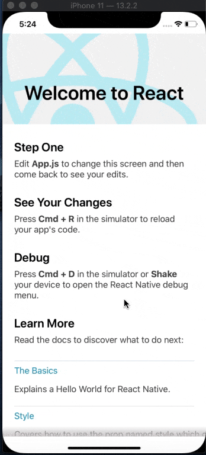
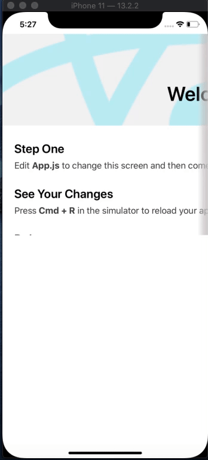

# rn-faded-scrollview
A simple and customisable React Native component that allows you to add fade effect in ScrollView at both ends.

Vertical Scroll             |  Horizontal Scroll
:-------------------------:|:-------------------------:
 | 

# Sponsor

## Installation
This library relies on [react-native-linear-gradient](https://github.com/react-native-community/react-native-linear-gradient). Follow setup instructions of linear gradient.

And now finally run in your project directory.

`npm install rn-faded-scrollview` 

OR

`yarn add rn-faded-scrollview` 

## Documentation
This library accepts all the props of [ScrollView](https://reactnative.dev/docs/scrollview) and some additional props.
### Props
| Name                      | Description                              | Default     | Type    |
|---------------------------|------------------------------------------|-------------|---------|
| allowStartFade               | Add fade at the start of ScrollView  | false           | Boolean  |
| allowEndFade               | Add fade at the end of ScrollView      | true       | Boolean  |
| fadeSize | Fade size i.e( width incase of horizontal and height incase of vertical ScrollView) | 20     | Number  |
| fadeColors          | Colors for fade effect        | ['rgba(229, 229, 229, 0.18)', 'rgba(206, 201, 201, 0.6)', 'rgba(206, 201, 201, 0.9)']     | Array  |
| scrollThreshold          | Threshold to control fade hide/show when it reaches start or end        | 10     | Number  |
| scrollEventThrottle          | This controls how often the scroll event will be fired while scrolling (as a time interval in ms)        | 16     | Number  |
| allowDivider          | Allow divider at fade end.      | false    | Boolean  |
| isRtl          | For RTL Layouts      | false    | Boolean  |
| onContentSizeChange          | onContentSizeChange call back added, function will return contentWidth and contentHeight      |     | Function  |

### Styling
For styling pass these props.

`containerStyle`, `startFadeStyle`, `endFadeStyle` and `dividerStyle`.

### Events
| Name                      | Callback param                              | Description     |
|---------------------------|------------------------------------------|-------------|
| isCloseToEnd               | Boolean  | if scroll is close to end or not.           |
| isCloseToStart               | Boolean      | if scroll is close to start or not.   |

## License
MIT
